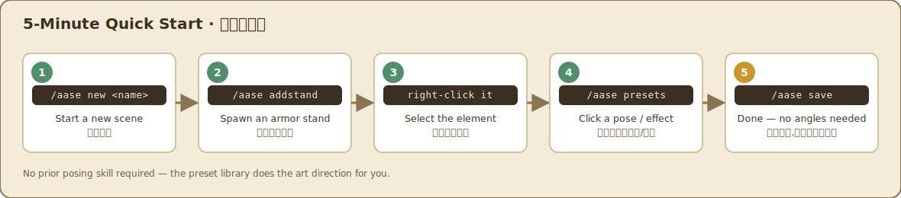
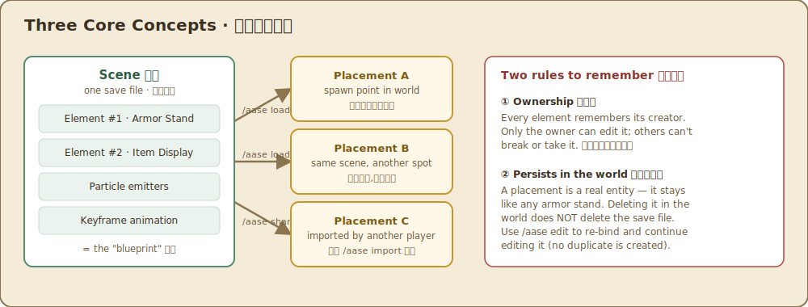
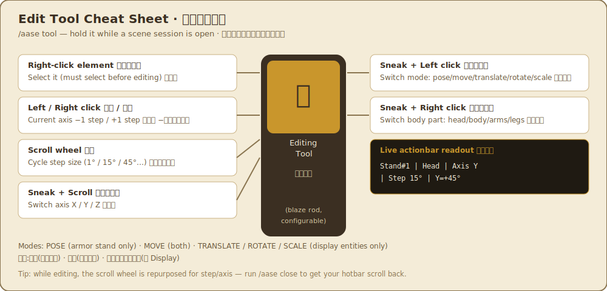

<div align="center">

# AwesomeArmorStandEditor

**A friendly armor stand / display-entity scene editor for survival & creative servers.**
一個為**生存與創造伺服器**打造的盔甲座 / Display 場景編輯器。

**[English](#english)** · **[繁體中文](#繁體中文)**

</div>

---

## English

> Status: static editor (P1) + particles (P2) + keyframe animation & mcfunction export (P3) + share codes / import & public API (P4) are all implemented. See [`docs/DESIGN.md`](docs/DESIGN.md) for the architecture and roadmap, and the [full manual](docs/MANUAL.en.md) for a deep-dive.

Pose armor stands and item/block/text displays with a hybrid GUI + in-world tool, no angle math required — pick a preset, click, done.



### Features

- **Preset library (zero-skill-required)**: can't pose anything? `/aase presets` opens a graphical library — click "attention / wave / cheer / sit…" to apply instantly; **Mirror** makes it left-right symmetric with one click; effect presets add particles with one click; save your own pose back into the library with `/aase pose save`.
- **Unified editing** for armor stands and display entities (item / block / text) — pose, transform, scale, rotation, equipment, flags, all through the same workflow.
- **Hybrid interaction**: a GUI control panel *and* a handheld tool for direct in-world nudging, with a live actionbar readout.
- **Particle effects**: attach particle emitters to a scene; they only fire when a player is nearby *and* the chunk is loaded, under a global per-tick budget.
- **Keyframe animation**: a timeline with keyframes and live preview playback (displays use client-side interpolation, armor stands are updated tick-by-tick).
- **Save / share / export**: every scene is a portable JSON blueprint you can place multiple times; `/aase share` produces a **share code** (gzip+Base64, safe to paste in chat) — the recipient runs `/aase import` to get the same build; export a `/summon` command (one-click copy) or a full **mcfunction datapack** (animation-driven).
- **Equipment menu**: `/aase equip` opens a graphical equipment GUI — click a hotbar/inventory item onto a slot to equip it, click with an empty cursor to unequip — **your items are never consumed or lost**.
- **Survival-safe**: element ownership tags (anti-griefing), per-player / per-chunk / global element caps, region-protection awareness; **anything that writes to server files (export, saving to the shared preset library) is admin/builder-only by default** (see [Permissions](#permissions)).
- **Zero hard dependencies, cross-platform**: runs on both Spigot and Paper; no other plugin required.

### Compatibility

- Minecraft / Paper / Spigot **26.2**, Java 25.
- Uses only the Bukkit/Spigot API surface; text goes through a shaded+relocated Adventure + MiniMessage stack, so it behaves the same on Spigot.
- Region-protection integration (GriefPrevention / WorldGuard / Towny / Lands…) works automatically via an event probe — **no hard dependency needed**.

### Installation

Drop `AwesomeArmorStandEditor-<version>.jar` into your server's `plugins/` folder and restart. No other dependencies.

### Core concepts



### Commands

| Command | Description |
|---|---|
| `/aase` | Open the control panel |
| `/aase tool` | Get the editing tool |
| `/aase presets` | Open the preset library (one-click poses/effects) |
| `/aase pose <id>` · `/aase pose save <id> [name]` · `/aase mirror` · `/aase fx <id>` | Apply/save a pose, mirror, add an effect |
| `/aase new <name>` | Start a new scene |
| `/aase addstand` · `/aase adddisplay <item\|block\|text>` | Add an element |
| `/aase equip` | Open the equipment menu (click items onto slots to equip, empty-hand click to unequip) |
| `/aase setblock/settext/setitem/setname/setequip/flag …` | Edit content, name, equipment, flags |
| `/aase particle add <type>` · `/aase particle clear` | Attach / clear particle emitters |
| `/aase anim key <tick>` · `length` · `loop` · `play` · `stop` · `clear` | Keyframe animation |
| `/aase save` · `/aase load <name>` · `/aase list` · `/aase info` | Save / place / list / scene info |
| `/aase edit` | Bind to and edit an existing nearby build (no duplicate is created) |
| `/aase share` · `/aase import <code> [name]` | Generate a share code / import someone else's |
| `/aase export command` · `/aase export function` | Export a summon command / mcfunction datapack (**writes server files, admin/builder-only by default**) |
| `/aase reload` | Reload configuration (admin) |

### Editing tool



### Permissions

Granted to every player by default (`default: true`): `aase.use`, `aase.create.armorstand`, `aase.create.display`, `aase.scene.save`, `aase.scene.share` (share codes never touch server files), `aase.animate`.

**Admin/builder-only by default (`default: op`)** — these write to server files or mutate server-wide shared data:

- `aase.export.command` — export summon commands / mcfunction datapacks (writes into `plugins/`).
- `aase.preset.save` — `/aase pose save` writes into the **server-wide shared** `presets.yml`.
- `aase.admin`, `aase.bypass.region`, `aase.bypass.limit`.

See `plugin.yml` for the full list; adjust freely with a permissions plugin like LuckPerms.

### API for developers

No compile-time dependency needed — just listen for two Bukkit events (package `com.tinyyana.awesomeArmorStandEditor.api`):

| Event | Fired | Cancellable |
|---|---|---|
| `AaseSceneSaveEvent(player, scene)` | after a player saves | No (notify-only) |
| `AaseScenePlaceEvent(player, scene, origin)` | before a blueprint is placed into the world (load / import) | Yes (cancelling blocks the placement) |

Share code format: `ShareCode.encode(scene)` = `AASE1:` + URL-safe Base64(gzip(JSON)); `ShareCode.decode(code)` decodes back to a `Scene` (invalid input returns `null`, never throws). The scene JSON itself is a readable, portable blueprint stored at `plugins/AwesomeArmorStandEditor/scenes/<owner-uuid>/<sceneId>.json`.

### Building

```bash
./gradlew build      # produces the shaded jar in build/libs/
./gradlew test       # pure-logic unit tests
./gradlew runServer  # local Paper test server
```

### Documentation

- [`docs/DESIGN.md`](docs/DESIGN.md) — architecture, data model, roadmap, performance & safety guardrails.
- [`docs/MANUAL.en.md`](docs/MANUAL.en.md) / [`docs/MANUAL.md`](docs/MANUAL.md) — the full user manual (English / 繁體中文).
- [`docs/TESTING.md`](docs/TESTING.md) — test steps (admin / player perspective).
- [`CHANGELOG.md`](CHANGELOG.md) — detailed release notes.

### License

[GNU AGPL-3.0](LICENSE). Free to use, including commercially, on any server. If you distribute a modified jar or its source — to anyone, including by running it as a network service that others interact with — you must make that modified source available under the same license. Just running it privately (even on a paid/commercial server) never triggers this.

---

## 繁體中文

> 狀態:P1 靜態編輯器 + P2 粒子 + P3 關鍵影格動畫/mcfunction 匯出 + P4 分享碼/匯入 + 對外事件 API 已實作。架構與路線圖見 [`docs/DESIGN.md`](docs/DESIGN.md),完整操作見[使用手冊](docs/MANUAL.md)。


### 特色

- **範本庫(零基礎友善)**:不會擺姿勢?`/aase presets` 開圖形範本庫,點「立正/揮手/萬歲/坐姿…」一鍵套用;「鏡像」一鍵左右對稱;特效範本點一下就加粒子;擺好的姿勢可 `/aase pose save` 存成自己的範本重用。
- **盔甲座 + Display 實體**(item / block / text display)統一編輯 —— 姿勢、變換、縮放、旋轉、裝備、旗標。
- **混合式操作**:控制面板 GUI + 手持工具在世界中直接微調,actionbar 即時讀數。
- **粒子特效**:元件場景可掛粒子發射器,只在附近有玩家 + 已載入區塊時發射,有每 tick 全域預算。
- **關鍵影格動畫**:時間軸 + 關鍵影格,即時預覽播放(Display 走客戶端插值,盔甲座逐 tick)。
- **存檔 / 分享 / 匯出**:每個場景是可攜的 JSON 藍圖,可重複放置;`/aase share` 產生一串**分享碼**(gzip+Base64,可在聊天貼給別人),對方 `/aase import` 一鍵拿到同一份作品;匯出 `/summon` 指令(一鍵複製)或 **mcfunction 資料包**(含動畫驅動)。
- **裝備選單**:`/aase equip` 開圖形裝備欄,手持物品點格子就穿上、空手點就卸下 —— **不會消耗或弄丟你的物品**。
- **生存服安全**:元件擁有權標記(反格里芬)、每人/每區塊/全域數量上限、尊重領地保護;**寫入伺服器檔案的功能(匯出、存進共用範本庫)預設只開放給管理員/建築師**(見權限)。
- **零硬依賴、跨平台**:在 Spigot 與 Paper 都能跑;不需要安裝任何其他外掛。

### 相容性

- Minecraft / Paper / Spigot **26.2**,Java 25。
- 只使用 Bukkit/Spigot API 面;文字用內嵌(shade+relocate)的 Adventure + MiniMessage,在 Spigot 上也一致運作。
- 領地整合(GriefPrevention / WorldGuard / Towny / Lands…)透過事件探針自動生效,**不需硬依賴**。

### 安裝

把 `AwesomeArmorStandEditor-<版本>.jar` 放進伺服器的 `plugins/`,重啟即可。無其他相依。

### 先懂三個概念


### 指令

| 指令 | 說明 |
|---|---|
| `/aase` | 開啟控制面板 |
| `/aase tool` | 取得編輯工具 |
| `/aase presets` | 開範本庫(姿勢/特效一鍵套用) |
| `/aase pose <id>` · `/aase pose save <id> [名稱]` · `/aase mirror` · `/aase fx <id>` | 套用/儲存姿勢、鏡像對稱、加特效 |
| `/aase new <名稱>` | 開始新場景 |
| `/aase addstand` · `/aase adddisplay <item\|block\|text>` | 新增元件 |
| `/aase equip` | 開裝備選單(手持物品點格子裝上,空手點卸下) |
| `/aase setblock/settext/setitem/setname/setequip/flag …` | 編輯內容、名稱、裝備、旗標 |
| `/aase particle add <類型>` · `/aase particle clear` | 掛 / 清 粒子發射器 |
| `/aase anim key <tick>` · `length` · `loop` · `play` · `stop` · `clear` | 關鍵影格動畫 |
| `/aase save` · `/aase load <名稱>` · `/aase list` · `/aase info` | 存 / 讀 / 清單 / 場景資訊 |
| `/aase edit` | 綁定並編輯附近既有作品(不產生分身) |
| `/aase share` · `/aase import <碼> [名稱]` | 產生分享碼 / 匯入別人的分享碼 |
| `/aase export command` · `/aase export function` | 匯出 summon 指令 / mcfunction 資料包(**寫入伺服器檔案,預設限管理員/建築師**) |
| `/aase reload` | 重載設定(管理) |

### 編輯工具


### 權限

預設開放給玩家(`default: true`):`aase.use`、`aase.create.armorstand`、`aase.create.display`、`aase.scene.save`、`aase.scene.share`(分享碼不落地伺服器檔案)、`aase.animate`。

**預設只給管理員/建築師(`default: op`)——這些會寫入伺服器檔案或改動全服共用資料**:

- `aase.export.command` —— 匯出 summon 指令 / mcfunction 資料包(寫進 `plugins/` 資料夾)。
- `aase.preset.save` —— `/aase pose save` 把姿勢存進**全服共用**的 `presets.yml`。
- `aase.admin`、`aase.bypass.region`、`aase.bypass.limit`。

詳見 `plugin.yml`;用 LuckPerms 等權限外掛可自由調整。

### 給開發者(API)

不需要編譯期依賴本插件 —— 監聽兩個 Bukkit 事件即可(套件 `com.tinyyana.awesomeArmorStandEditor.api`):

| 事件 | 時機 | 可取消 |
|---|---|---|
| `AaseSceneSaveEvent(player, scene)` | 玩家存檔後 | 否(純通知) |
| `AaseScenePlaceEvent(player, scene, origin)` | 藍圖放進世界前(load / import) | 是(取消即擋下放置) |

分享碼格式:`ShareCode.encode(scene)` = `AASE1:` + URL-safe Base64(gzip(JSON));`ShareCode.decode(code)` 解回 `Scene`(輸入無效回 `null`,不丟例外)。場景 JSON 本身是可讀的可攜藍圖,存在 `plugins/AwesomeArmorStandEditor/scenes/<owner-uuid>/<sceneId>.json`。

### 建置

```bash
./gradlew build      # 產生 shaded jar 於 build/libs/
./gradlew test       # 純邏輯單元測試
./gradlew runServer  # 本機 Paper 測試伺服器
```

### 文件

- [`docs/DESIGN.md`](docs/DESIGN.md) — 架構、資料模型、路線圖、效能與安全紅線。
- [`docs/MANUAL.md`](docs/MANUAL.md) / [`docs/MANUAL.en.md`](docs/MANUAL.en.md) — 完整使用說明手冊(繁體中文 / English)。
- [`docs/TESTING.md`](docs/TESTING.md) — 測試步驟(管理員 / 玩家視角)。
- [`CHANGELOG.md`](CHANGELOG.md) — 詳細版本變更紀錄。

### 授權

[GNU AGPL-3.0](LICENSE)。可自由使用,包含商用伺服器。若你把修改過的 jar 或原始碼交給任何人——包含把修改版跑成讓別人連線互動的網路服務——就必須把修改後的原始碼以同一授權公開。單純私下(即使是營利伺服器)拿來跑,不會觸發這個義務。
