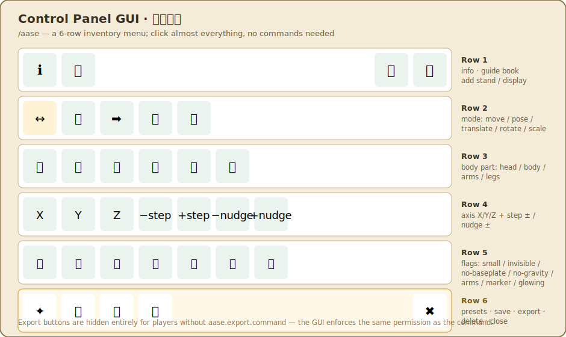

# AwesomeArmorStandEditor — User Manual

> This is the exhaustive reference. In-game there's also a short paginated guide book (`/aase guide`); this document is the full version.
> Audience: everyone from "I have never posed anything" to "I want to build animations and export a datapack."
>
> 繁體中文版請見 [`MANUAL.md`](MANUAL.md)。

---

## Table of contents

1. [What this is](#1-what-this-is)
2. [Installation](#2-installation)
3. [Three core concepts](#3-three-core-concepts)
4. [5-minute quick start (no art skills needed)](#4-5-minute-quick-start-no-art-skills-needed)
5. [Full workflow](#5-full-workflow)
6. [The editing tool in detail](#6-the-editing-tool-in-detail)
7. [Control panel GUI](#7-control-panel-gui)
8. [Preset library: poses / effects / mirror / save-your-own](#8-preset-library)
9. [Armor stands: pose · equipment · flags](#9-armor-stands)
10. [Display entities: item / block / text](#10-display-entities)
11. [Particle effects](#11-particle-effects)
12. [Animation (keyframes) — key chapter](#12-animation-keyframes)
13. [Save · load · share · edit an existing build](#13-save-load-share-edit-an-existing-build)
14. [Export: commands / mcfunction datapack](#14-export)
15. [Command reference](#15-command-reference)
16. [Permission reference](#16-permission-reference)
17. [Configuration files](#17-configuration-files)
18. [Troubleshooting FAQ](#18-troubleshooting-faq)
19. [Performance & safety design](#19-performance--safety-design)
20. [Roadmap: towards a full animation tool](#20-roadmap)

---

## 1. What this is

A scene editor that lets survival and creative players freely customize armor stands and display entities. You can:

- Pose armor stands, dress them in equipment, toggle flags (invisible, no-baseplate, glowing…)
- Place display entities (item / block / text) with free scale, rotation, and tilt — degrees of freedom armor stands don't have
- Attach particle effects
- Animate with keyframes, with live preview playback
- Save, share, place multiple copies, and re-bind to an existing build to keep editing it
- Export as a `/summon` command or an mcfunction datapack

It is **standalone, open-source-friendly, and cross-platform (Spigot/Paper)** — no other plugin is required.

## 2. Installation

Drop `AwesomeArmorStandEditor-<version>.jar` into the server's `plugins/` folder and restart. On first boot it generates:

```
plugins/AwesomeArmorStandEditor/
  config.yml      behavior / performance settings
  messages.yml    every player-facing string (translatable)
  presets.yml     pose and effect presets (freely editable)
  guide.yml       in-game guide book pages
  scenes/         your saves (one folder per player)
  exports/        exported commands / datapacks
```

After editing config, run `/aase reload` (no restart needed).

## 3. Three core concepts

| Concept | Meaning |
|---|---|
| **Scene** | One build = one save file. It holds multiple elements + particles + animation. |
| **Element** | A single node in a scene: one armor stand, or one display entity. Each has an index `#1 #2…`. |
| **Blueprint vs. world entity** | The save file is a "blueprint"; what you see in the world is one *placement* of that blueprint. Deleting the world entity does not delete the save; the same save can be placed in many locations. |


Two more rules worth remembering:

- **Ownership**: every element remembers who made it. You can only edit your own; others can't break or take your build.
- **It persists in the world**: a placed build is a real entity and stays there like any ordinary armor stand. To keep editing it, stand next to it and run `/aase edit` to re-bind — this does **not** create a duplicate.

## 4. 5-minute quick start (no art skills needed)


```
/aase new My Build       ← start a new scene
/aase addstand           ← spawn an armor stand at your feet
right-click the stand    ← select it (you must select before editing)
/aase presets            ← open the graphical preset library
  → click "Wave / Cheer / Sit…" on the top row → the stand instantly poses
  → click "Mirror" for left-right symmetry
  → click "Flame Ring / Heart / Cherry Blossom" on the bottom row → particles added directly
/aase save                ← save
```

**You never see a single angle number.** This is the path built for people with zero posing sense.
Once you land on a pose you like, `/aase pose save MySignature` saves it as your own preset — `/aase pose MySignature` recalls it instantly afterwards.

## 5. Full workflow

1. `/aase new <name>` — start a scene (your current position becomes the build's origin).
2. `/aase tool` — get the editing tool.
3. Add elements: `/aase addstand` or `/aase adddisplay item|block|text`.
4. Select an element: **right-click** it with the tool.
5. Adjust: via presets (`/aase presets`), the tool, or the control panel (`/aase`).
6. (Optional) add particles: `/aase particle add <type>` or a preset effect.
7. (Optional) animate: see §12.
8. `/aase save`.
9. Later: `/aase load <name>` to place another copy, `/aase edit` to keep editing an existing build, `/aase export …` to export.

## 6. The editing tool in detail

`/aase tool` gives you a tool (a blaze rod by default, configurable). While a scene session is open, holding it:

| Action | Effect |
|---|---|
| **Right-click an element** | Select it |
| **Left-click** (air/block) | Current axis **−** one step |
| **Right-click** (air/block) | Current axis **+** one step |
| **Scroll wheel** | Cycle step size (e.g. 1° / 15° / 45°) |
| **Sneak + scroll** | Switch axis X / Y / Z |
| **Sneak + left-click** | Switch mode (pose / move / translate / rotate / scale) |
| **Sneak + right-click** | Switch body part (head / body / left-right arm / left-right leg, armor stand pose only) |


The actionbar shows a live readout: `Stand#1 | Head | Axis Y | Step 15° | Y=+45°`.

> Note: while a scene is being edited, the scroll wheel is repurposed for step/axis switching. To scroll your hotbar normally again, run `/aase close` or drop the tool.

**Modes**:

- **POSE**: armor stands only. Rotate a single body part.
- **MOVE**: both element types. Translate the whole element along an axis.
- **TRANSLATE / ROTATE / SCALE**: displays only. Edit its internal transform.

## 7. Control panel GUI

`/aase` opens the control panel. If you don't want to memorize commands, almost everything is clickable here:



- **Top row**: info, guide book (📖, top-right), add armor stand / item / block / text display
- **Mode row**: move / pose / translate / rotate / scale (the active one is marked)
- **Body part row**: head / body / left-right arm / left-right leg
- **Axis + nudge row**: X / Y / Z, step −/+, nudge −/+
- **Flags row**: small / invisible / no-baseplate / no-gravity / arms / marker / glowing, equipment shortcut
- **Bottom row**: ✦ preset library, save, export, delete, close

## 8. Preset library

`/aase presets` (or the "Preset library" button in the panel's bottom row) opens the graphical preset library.

- **Top row = pose presets**: click to apply to the currently selected armor stand. Built-in: attention, T-pose, cheer, wave, point, think, sit, run.
- **Bottom row = effect presets**: click to add a tuned particle set to the selected element (or your position). Built-in: flame ring, heart, cherry blossom, stardust, soul fire.
- **Mirror button**: mirrors the left arm/leg angles onto the right side — a one-click fix for the thing non-artists get wrong most often.

**Command equivalents**: `/aase pose <id>`, `/aase fx <id>`, `/aase mirror`.

**Saving your own preset**: pose an armor stand → `/aase pose save <id> [name]`. This writes the current pose into `presets.yml`, and `/aase pose <id>` will recall it afterwards. You bring the aesthetics; the plugin remembers them.

> Built-in pose angles are conservative approximations and may not be perfect — either edit the numbers (in degrees) directly in `presets.yml` and `/aase reload`, or fine-tune in-game and overwrite with `pose save`.

## 9. Armor stands

**Pose**: six body parts (head / body / left arm / right arm / left leg / right leg), each with three axes (X tilt front-back, Y turn left-right, Z lean sideways), in degrees. Adjust via presets, the tool, or the panel.

**Equipment (menu, recommended)**: select an armor stand → `/aase equip` (or the panel's "Equipment" button) → opens the equipment menu. **Click an inventory item onto your cursor, then click the helmet/chestplate/leggings/boots/main-hand/off-hand slot** to equip it; **click a slot with an empty cursor to unequip**. This only ever copies the item on your cursor to the stand — **your items are never consumed or duplicated**.

**Equipment (command, legacy path)**: hold the item in your **off-hand**, run `/aase setequip <slot>`: `head / chest / legs / feet / mainhand / offhand`. Empty off-hand clears that slot.

**Flags**: `/aase flag <name>` or toggle from the panel's flags row:

| Flag | Effect |
|---|---|
| small | Mini armor stand |
| invisible | Invisible (only equipment is visible) |
| nobaseplate | Removes the baseplate |
| nogravity | No gravity (on by default while editing) |
| arms | Show arms (lets you pose them) |
| marker | Marker mode: no hitbox, tiny, commonly used as a decorative base |
| glowing | Glowing outline |

**Naming**: `/aase setname <MiniMessage>`, e.g. `/aase setname <red>Guardian`. Leave blank to clear it.

## 10. Display entities

Display entities are far more flexible than armor stands: arbitrary scale, arbitrary rotation, no hitbox. Three kinds:

- **Item display**: shows an item. `/aase adddisplay item` (uses your off-hand item by default, stone if empty); then `/aase setitem` (off-hand item) to change it.
- **Block display**: shows a block. `/aase adddisplay block` → `/aase setblock minecraft:oak_log`.
- **Text display**: floating text. `/aase adddisplay text` → `/aase settext <MiniMessage>`.

Editing the transform: select it, switch the tool to **translate / rotate / scale** mode, or use the control panel. Display rotation/scale is the smoothest carrier for animation (see §12).

## 11. Particle effects

`/aase particle add <particle type>` (tab-complete for a common list, e.g. FLAME / HEART / CHERRY_LEAVES / END_ROD / DUST / SOUL_FIRE_FLAME). The emitter is added at your current position (relative to the scene origin). `/aase particle clear` removes every emitter in the scene. The preset library's bottom row is a faster way to get a tuned effect.

**Performance design**: emitters are invisible marker entities that only fire when their chunk is loaded *and* a player is nearby, under a global per-tick processing cap (config `particles.budget-per-tick`). Placing a lot of them won't tank server TPS.

## 12. Animation (keyframes)

> This is the foundation this tool is designed to grow into a full animation tool from. Understand the concept before diving in.

### Concept

An animation is a timeline (length measured in **ticks**, 20 ticks = 1 second) with one **track** per element, and **keyframes** on each track. During playback, the plugin **interpolates** between keyframes automatically — you only need to pose a handful of key moments and everything in between animates itself.

### Building an animation (steps)

1. Place your scene's elements (`/aase addstand`, etc.) inside a session.
2. Select an element, pose its **starting** frame → `/aase anim key 0` (records a keyframe at tick 0).
3. Pose the same element into its **ending** frame → `/aase anim key 20` (records a keyframe at tick 20).
4. `/aase anim length 20` sets the animation's total length.
5. `/aase anim play` → the element smoothly loops between the two poses.
6. `/aase anim loop` toggles looping; `/aase anim stop` stops and reverts to the saved pose; `/aase anim clear` wipes the animation.

Multiple elements with their own `key` calls animate together. For finer control, record more keyframes (e.g. 0 / 10 / 20 / 30).

### How interpolation works

- Position / scale: linear interpolation.
- Display rotation: quaternion shortest-path interpolation (nlerp) — no unexpected spins.
- Pose angles: linear interpolation per axis.

### Performance & choosing a carrier (important)

- **Display entities** use client-side interpolation — near-zero server cost, the smoothest option. **Prefer displays for animation.**
- **Armor stands** have no client-side interpolation; the plugin re-poses them tick-by-tick during playback, which has a real cost — so armor stand animation playback **only runs during your editing session**, never persistently.
- For a build that "just keeps animating on its own in the world" → **export an mcfunction datapack** (§14), which drives the animation server-side without costing an editing session.

### Current limitations

- Animation editing is currently command-driven (`/aase anim …`) — there's no visual timeline GUI yet (see §20 roadmap).
- Live playback only runs inside an editing session; it stops automatically on logout/leave.

## 13. Save, load, share, edit an existing build

- `/aase save` — saves to `scenes/<your-uuid>/<scene-id>.json`.
- `/aase list` — your list of scenes.
- `/aase load <name>` — places **a new copy** at your feet (you can place several).
- `/aase edit` — stand next to an existing build to **re-bind** it as your session and keep editing (no duplicate is created).
- `/aase close` — ends the editing session (the build stays in the world).
- `/aase info` — current scene info (element count, armor stands/displays, emitters, animation, selection, save state).
- **Share code (recommended)**: `/aase share` → chat shows a **click-to-copy** share code (`AASE1:...`, a compressed scene); paste it to someone else, and their `/aase import <code> [new name]` places the same build at their feet (ownership becomes theirs, with a new id — your save is unaffected). Import is gated by the per-player element cap; an invalid code just reports "invalid," never an error.
- **File sharing**: the JSON file is portable too — hand someone `scenes/…/xxx.json` and have them drop it into their own `scenes/<their-uuid>/` (remember to edit the `owner` field inside).

## 14. Export

### Summon command

`/aase export command` — chat shows a **click-to-copy** button that copies the whole scene's `/summon` command to your clipboard; it's also saved as `exports/<scene>.txt`. Paste it in-game or into a command block to reproduce the build.

### mcfunction datapack

`/aase export function` — exports a datapack to `exports/<scene>/datapack/`:

```
pack.mcmeta
data/aase/function/summon.mcfunction     ← summons the whole scene (elements carry tags)
(if there's an animation, also:)
data/aase/function/load.mcfunction        ← initializes the timer
data/aase/function/tick.mcfunction        ← drives keyframe playback (self-scheduling every tick)
data/aase/function/frames/frame_*.mcfunction
```

Usage: drop the folder into the world's `datapacks/`, run `/reload`, then:

- Static: `/function aase:summon`
- Animated: `/function aase:load` → `/function aase:summon` → `/function aase:tick`

> **NBT has been tested against 26.2**: pose/flags/equipment/transform/item/block/brightness/glow are all correct; custom names and text use SNBT (`CustomName:"name"`, `text:"text"`, not the legacy JSON string). Still best-effort: `pack_format` and the `function` folder name may need adjusting per version; equipment only carries the item id, blocks only carry the block name, and names/text lose color. `SummonExporter` / `McFunctionExporter` are the single points to patch.

## 15. Command reference

| Command | Description | Permission |
|---|---|---|
| `/aase` | Open the control panel | aase.use |
| `/aase guide` | Open the paginated in-game book | aase.use |
| `/aase tool` | Get the editing tool | aase.use |
| `/aase new <name>` | New scene | aase.use |
| `/aase presets` | Preset library GUI | aase.use |
| `/aase pose <id>` / `pose save <id> [name]` | Apply / save a pose | aase.use |
| `/aase fx <id>` | Add an effect preset | aase.use |
| `/aase mirror` | Left-right mirror | aase.use |
| `/aase addstand` | Add an armor stand | aase.create.armorstand |
| `/aase adddisplay <item\|block\|text>` | Add a display | aase.create.display |
| `/aase equip` | Equipment menu (click slots to equip/unequip) | aase.use |
| `/aase setblock/settext/setitem/setname/setequip/flag …` | Edit content | aase.use |
| `/aase particle add <type>` / `clear` | Particles | aase.use |
| `/aase anim key/length/loop/play/stop/clear` | Animation | aase.animate |
| `/aase save` / `load <name>` / `list` / `info` / `edit` / `delete` | Save/load/list/info/edit/delete | aase.use / aase.scene.save |
| `/aase share` / `import <code> [name]` | Share code / import | aase.scene.share |
| `/aase pose save <id> [name]` | Save into the shared preset library | **aase.preset.save (default: OP)** |
| `/aase export command` / `export function` | Export (writes server files) | **aase.export.command (default: OP)** |
| `/aase close` | End editing session | aase.use |
| `/aase reload` | Reload configuration | aase.admin |

> Why `export` / `pose save` are OP-only by default: both **write to server files or mutate the server-wide shared `presets.yml`**, which isn't appropriate to hand to every player (it invites file/preset-library spam). The control panel's export button is **hidden entirely** for players without the permission — clicking it does nothing. Grant `aase.export.command` / `aase.preset.save` to a builder group with LuckPerms to allow it.

## 16. Permission reference

```
aase.use                 open the editor / use the tool (default: everyone)
aase.create.armorstand   place armor stands (default: everyone)
aase.create.display      place displays (default: everyone)
aase.scene.save          save (own save folder, default: everyone)
aase.scene.share         generate / import share codes (never writes files, default: everyone)
aase.animate             animation (default: everyone)
aase.export.command      export commands / datapacks (writes server files) — default: OP
aase.preset.save         /aase pose save writes the server-wide presets.yml — default: OP
aase.admin               admin (edit others' builds, reload, purge) — default: OP
aase.bypass.region       bypass region checks — default: OP
aase.bypass.limit        bypass element caps — default: OP
```

## 17. Configuration files

- **config.yml**: tool material, step sizes, per-player/per-chunk/global element caps, region-event-probe toggle, particle budget and range.
- **presets.yml**: pose and effect presets (angles in degrees, freely editable; `/aase pose save` writes here).
- **messages.yml**: every player-facing string (MiniMessage, translatable; command names use `<aqua>`, click hints use `<yellow>`).
- **guide.yml**: each page of the in-game paginated guide book (the book has a parchment background — use dark colors).

All of the above take effect with `/aase reload`, no restart needed.

## 18. Troubleshooting FAQ

**Q: The tool's left/right click does nothing?** Start a session with `/aase new` or `/aase edit` first, then right-click an element with the tool to select it.

**Q: The scroll wheel won't switch hotbar slots?** While editing, the scroll wheel is repurposed for step/axis. Run `/aase close` to end the session.

**Q: Can't place anything, "this area is protected"?** You're in someone else's claim. Move to your own land, or ask an admin to grant `aase.bypass.region`.

**Q: `load` after editing creates two copies?** `load` always places **a new copy**. To keep editing an existing build, use `/aase edit`.

**Q: The animation stops instead of running forever?** Live playback only runs during an editing session. For a persistent animation, `export function` and drive it with the datapack.

**Q: A preset pose looks off?** Built-in angles are approximations. Edit `presets.yml`, or pose it yourself and overwrite with `pose save`.

**Q: The exported command looks wrong in-game?** NBT export is best-effort and version-sensitive. Report it so `SummonExporter`/`McFunctionExporter` can be fixed.

## 19. Performance & safety design

- **No world/chunk scanning**: element counts are tracked in memory; orphaned entities are only handled when their chunk loads.
- **Particles are budgeted**: only fire near a player in a loaded chunk, under a server-wide per-tick cap.
- **Animation is throttled**: displays use client-side interpolation; armor stand tick-by-tick updates only run inside an editing session and stop automatically when you log off.
- **Anti-grief**: elements carry an ownership PDC tag — others can't break or take them; caps prevent spam; region-protection plugins are respected.
- **Cross-platform**: only Bukkit/Spigot API surface is used; text goes through shaded-in Adventure, so it works fine on Spigot too.

## 20. Roadmap

Next steps towards a "full animation tool" (not yet built):

- **Visual timeline GUI**: drag keyframes, scrub a preview, replacing the current `/aase anim` commands.
- **In-between pose helper**: pick two saved poses, generate the animation between them with one click.
- **Easing**: ease-in/out beyond linear, for more natural motion.
- **Better share codes / one-click import**: compress a build or preset pack into a shareable code.
- **More external API / events**: let other plugins hook into our save/place events.
- **Drag-and-drop equipment GUI**, a visual editor for particles/animation.

Let the author know if you have a preferred priority order.
